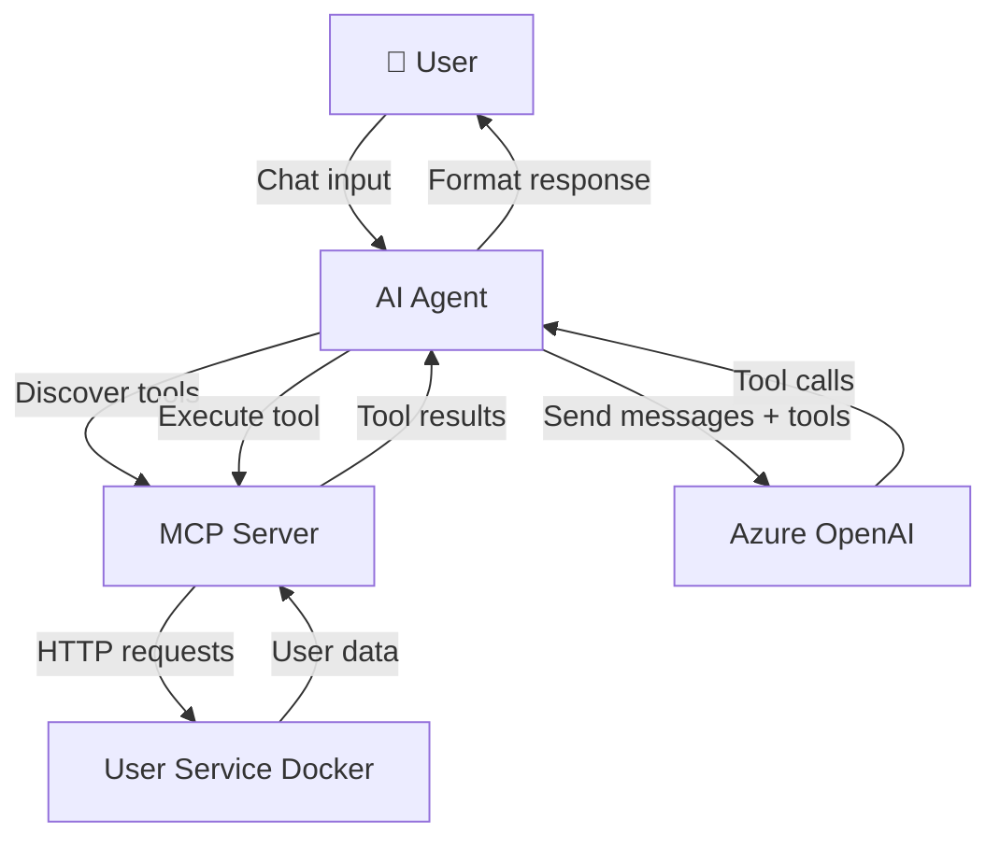

# AI DIAL MCP Fundamentals

> Educational implementation demonstrating Model Context Protocol (MCP) client-server architecture for AI agent tool integration.

## Overview

This project provides a hands-on learning environment for building AI agents using the Model Context Protocol (MCP). It consists of two main components:

1. **MCP Server** - Exposes CRUD tools for user management via FastMCP
2. **AI Agent** - Consumes MCP tools and interacts with users via Azure OpenAI (DIAL API)

The system demonstrates how AI agents can discover and execute tools dynamically through a standardized protocol, enabling extensible and maintainable agent architectures.

## Quick Start

### Prerequisites

- Python 3.13+ with virtual environment
- Docker and Docker Compose
- EPAM VPN connection (for DIAL API access)
- Azure OpenAI API key (DIAL_API_KEY)

### 5-Minute Setup

```bash
# 1. Clone and navigate to project
cd /Users/Dzianis_Haurylovich/Documents/git/git.epam.com/ai-dial-mcp-fundamentals

# 2. Activate virtual environment
source dial_mcp/bin/activate

# 3. Start User Service (Docker)
docker-compose up -d

# 4. Start MCP Server (Terminal 1)
python mcp_server/server.py

# 5. Set API key and start Agent (Terminal 2)
export DIAL_API_KEY="your-api-key-here"
python agent/app.py
```

**Expected output:**
```
[App] User Management Agent is ready. Type your message...
You: search for users named John
🤖: Found 15 users matching 'John'...
```

### Verify Installation

```bash
# Check User Service (should return 1000 mock users)
curl http://localhost:8041/v1/users

# Check MCP Server (should show server info)
curl http://localhost:8005/mcp
```

## Project Structure

```
ai-dial-mcp-fundamentals/
├── mcp_server/              # FastMCP server with user management tools
│   ├── server.py            # Tool/resource/prompt definitions
│   ├── user_client.py       # HTTP client for User Service
│   └── models/              # Pydantic schemas
├── agent/                   # AI agent client
│   ├── app.py              # Console chat loop
│   ├── mcp_client.py       # MCP protocol client
│   ├── dial_client.py      # Azure OpenAI client with tool orchestration
│   ├── prompts.py          # System prompt
│   └── models/             # Message models
├── data/                    # User Service persistence (Docker volume)
├── docs/                    # This documentation
└── docker-compose.yml       # User Service container
```

## Key Features

### MCP Server Capabilities
- **5 Tools**: get_user_by_id, search_user, add_user, update_user, delete_user
- **1 Resource**: API flow diagram (PNG)
- **2 Prompts**: Search guidance, profile creation best practices
- **Transport**: HTTP streams (streamable-http)

### Agent Capabilities
- **Tool Discovery**: Automatic detection of MCP server tools
- **Streaming Responses**: Real-time LLM output via Azure OpenAI
- **Recursive Execution**: Multi-step tool chains (e.g., search → get → update)
- **Error Handling**: Graceful failures with user-friendly messages

## Architecture Highlights



**Critical integrations:**
- MCP Client ↔ MCP Server: HTTP streams with session management
- DIAL Client ↔ Azure OpenAI: Streaming chat completions with tool calling
- MCP Server ↔ User Service: REST API (GET/POST/PUT/DELETE)

## Learning Objectives

By exploring this codebase, you will understand:

1. **MCP Protocol Basics**
   - Tool/resource/prompt definitions
   - Client-server session lifecycle
   - Schema transformation (MCP → DIAL format)

2. **Agent Architecture**
   - Recursive completion loop (LLM → tools → LLM)
   - Tool call streaming and accumulation
   - Message history management

3. **Tool Calling Patterns**
   - Function parameter validation
   - Error propagation and recovery
   - Multi-turn conversations with state

4. **Production Considerations**
   - Async context manager patterns
   - Connection pooling and cleanup
   - Environment configuration

## Common Use Cases

### Example 1: Search and Update User
```
You: Find users named Alice and update the first one's company to "EPAM"
🤖: [Executes search_user → get_user_by_id → update_user]
     Updated Alice Johnson (ID: 42) - Company set to EPAM
```

### Example 2: Create New User
```
You: Add a new user named Bob Smith with email bob@example.com
🤖: [Executes add_user with validated data]
     Created user Bob Smith (ID: 1001)
```

### Example 3: Multi-Step Workflow
```
You: Find all users at Google and get details for the first 3
🤖: [Executes search_user → get_user_by_id (3 times)]
     Found 5 users at Google. Details for first 3: ...
```

## Troubleshooting Quick Reference

| Issue | Likely Cause | Solution |
|-------|-------------|----------|
| "MCP client not connected" | Forgot context manager | Use `async with mcp_client` |
| "Tool call failed" | MCP server not running | Check `python mcp_server/server.py` |
| "DIAL_API_KEY not set" | Missing env var | `export DIAL_API_KEY=...` |
| "User Service unreachable" | Docker not running | `docker-compose up -d` |
| "Tool schema mismatch" | Wrong DIAL format | Check `tools[].type="function"` wrapper |

## Documentation Map

- **[Architecture](./architecture.md)** - System design, data flow, component boundaries
- **[API Reference](./api.md)** - Tool signatures, resources, prompts
- **[Setup Guide](./setup.md)** - Environment configuration, dependencies, commands
- **[Testing](./testing.md)** - Test strategy, Postman collection, debugging
- **[Glossary](./glossary.md)** - MCP terminology, abbreviations
- **[ADRs](./adr/)** - Architecture decision records
- **[Roadmap](./roadmap.md)** - Future enhancements, known limitations

## Next Steps

1. **Explore the code**: Start with [mcp_server/server.py](../mcp_server/server.py) to see tool definitions
2. **Run the agent**: Follow [Setup Guide](./setup.md) for detailed configuration
3. **Read architecture**: Understand component interactions in [Architecture](./architecture.md)
4. **Try advanced challenges**: Multi-server support (users + fetch MCP)

## Support & Contributing

- **Issues**: Report bugs or feature requests via project issue tracker
- **Questions**: Refer to [Glossary](./glossary.md) for terminology
- **Improvements**: Follow existing patterns in codebase

## License

Educational project for EPAM internal use.

---

**Last updated:** 2025-12-31  
**Version:** 1.0.0  
**Maintainers:** AI DIAL Team
