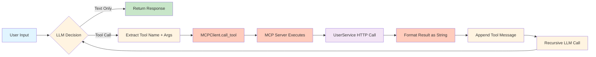

# System Architecture

## Table of Contents
- [Overview](#overview)
- [Component Diagram](#component-diagram)
- [Data Flow](#data-flow)
- [Component Responsibilities](#component-responsibilities)
- [Integration Patterns](#integration-patterns)
- [Architecture Decisions](#architecture-decisions)
- [Constraints & Limitations](#constraints--limitations)

## Overview

The AI DIAL MCP Fundamentals project implements a **client-server architecture** based on the Model Context Protocol (MCP), enabling an AI agent to perform user management operations through dynamically discovered tools.

### System Layers


### Design Principles

1. **Protocol-Based Communication**: MCP standardizes tool discovery and execution
2. **Async-First**: All I/O operations use async/await for non-blocking execution
3. **Schema Validation**: Pydantic models ensure type safety at runtime
4. **Separation of Concerns**: Clear boundaries between agent logic, protocol handling, and business operations
5. **Error Propagation**: Exceptions bubble up with context for debugging

## Component Diagram


## Data Flow

### Tool Discovery Flow


### Conversation Flow (Tool Execution)


### Tool Execution Pipeline



## Component Responsibilities

### 1. Agent Layer (`agent/`)

#### app.py - Application Entry Point
**Responsibilities:**
- Initialize MCP client connection with context manager
- Discover tools, resources, and prompts from MCP server
- Build initial conversation history (system prompt + MCP prompts)
- Manage console chat loop with user input/output
- Handle graceful shutdown on exit commands

**Key functions:**
- `main()`: Orchestrates agent lifecycle
- Error handling: Network failures logged without terminating loop

#### mcp_client.py - MCP Protocol Client
**Responsibilities:**
- Establish HTTP stream connection to MCP server
- Manage session lifecycle (initialize, cleanup)
- Discover tools and transform schemas to DIAL format
- Execute tool calls via MCP protocol
- Retrieve resources (binary/text) and prompts

**Key functions:**
- `__aenter__/__aexit__`: Context manager for connection management
- `get_tools()`: List tools and transform to OpenAI format
- `call_tool(name, args)`: Execute tool and return result
- `get_resources()`: Discover static resources
- `get_prompts()`: Discover MCP prompts

**Critical pattern:**
```python
async with streamablehttp_client(url) as (read, write, _):
    async with ClientSession(read, write) as session:
        await session.initialize()
```

#### dial_client.py - Azure OpenAI Orchestrator
**Responsibilities:**
- Stream LLM responses with tool calling enabled
- Accumulate tool call deltas from streaming chunks
- Execute tool calls via MCPClient
- Implement recursive agent loop until no tool calls remain
- Format tool results as messages for LLM consumption

**Key functions:**
- `get_completion(messages)`: Main agent loop with recursion
- `_stream_response(messages)`: Stream and collect LLM output
- `_call_tools(ai_message, messages)`: Execute and append tool results
- `_collect_tool_calls(deltas)`: Reconstruct complete tool calls

**Recursion logic:**
```python
if ai_message.tool_calls:
    messages.append(ai_message)
    await self._call_tools(ai_message, messages)
    return await self.get_completion(messages)  # Recurse
return ai_message  # Base case: no tool calls
```

#### models/message.py - Conversation State
**Responsibilities:**
- Define message schema for agent-LLM interactions
- Serialize messages to OpenAI API format
- Track role (SYSTEM, USER, AI, TOOL)
- Store tool call metadata (ID, name, arguments)

**Key classes:**
- `Role`: Enum for message roles
- `Message`: Pydantic model with `to_dict()` serialization

### 2. MCP Server Layer (`mcp_server/`)

#### server.py - FastMCP Tool Provider
**Responsibilities:**
- Define 5 CRUD tools via `@mcp.tool()` decorator
- Define 1 resource (flow diagram PNG) via `@mcp.resource()`
- Define 2 prompts (search/creation guidance) via `@mcp.prompt()`
- Delegate business logic to UserClient
- Return formatted strings (not raw JSON) for LLM consumption

**Key tools:**
- `get_user_by_id(user_id)`: Retrieve single user
- `search_user(name, surname, email, gender)`: Query users
- `add_user(...)`: Create new user
- `update_user(user_id, ...)`: Patch user fields
- `delete_user(user_id)`: Remove user

**Pattern:**
```python
@mcp.tool()
async def get_user_by_id(user_id: int) -> str:
    return await user_client.get_user(user_id)
```

#### user_client.py - REST API Wrapper
**Responsibilities:**
- Wrap User Service HTTP calls (GET/POST/PUT/DELETE)
- Format JSON responses as markdown code blocks
- Raise exceptions on HTTP errors (4xx/5xx)
- Handle request/response serialization

**Key functions:**
- `get_user(user_id)`: GET /v1/users/{id}
- `search_users(filters)`: GET /v1/users/search
- `add_user(user)`: POST /v1/users
- `update_user(user_id, user)`: PUT /v1/users/{id}
- `delete_user(user_id)`: DELETE /v1/users/{id}

**Response formatting:**
```python
def __user_to_string(user_dict: dict) -> str:
    return f"```\nUser ID: {user_dict['id']}\nName: ...\n```"
```

#### models/user_info.py - Data Models
**Responsibilities:**
- Define Pydantic schemas for user CRUD operations
- Validate nested objects (Address, CreditCard)
- Provide request/response serialization

**Key models:**
- `UserCreate`: Required fields for user creation
- `UserUpdate`: Optional fields for patching
- `UserSearchRequest`: Query filters
- `Address`, `CreditCard`: Nested models

### 3. External Services

#### Azure OpenAI (DIAL API)
**Responsibilities:**
- Process chat completions with streaming
- Execute tool calls based on LLM decisions
- Return tool call instructions (name + arguments)

**Configuration:**
- Model: gpt-4o
- API version: 2025-01-01-preview
- Endpoint: `https://ai-proxy.lab.epam.com`
- Auth: DIAL_API_KEY environment variable

#### User Service (Docker)
**Responsibilities:**
- Provide REST API for user CRUD operations
- Persist data in SQLite database
- Auto-generate 1000 mock users on startup

**Configuration:**
- Port: 8041 (host) → 8000 (container)
- Volume: `./data:/app/data`
- Image: `khshanovskyi/mockuserservice:latest`

## Integration Patterns

### Pattern 1: Async Context Managers
All network resources use async context managers for cleanup:
```python
async with MCPClient(url) as mcp_client:
    tools = await mcp_client.get_tools()
    # Auto-cleanup on exit
```

### Pattern 2: Schema Transformation
MCP tool schemas → DIAL format for LLM:
```python
{
    "type": "function",
    "function": {
        "name": tool.name,
        "description": tool.description,
        "parameters": tool.inputSchema  # JSON Schema
    }
}
```

### Pattern 3: Recursive Agent Loop
Continue until LLM stops requesting tools:
```python
async def get_completion(messages):
    response = await llm_call(messages)
    if response.tool_calls:
        execute_tools(response.tool_calls)
        return await get_completion(messages)  # Recurse
    return response  # Done
```

### Pattern 4: Tool Result Formatting
Always return strings (not JSON) for LLM readability:
```python
def format_user(user):
    return f"```\nUser ID: {user['id']}\nName: {user['name']}\n```"
```

### Pattern 5: Error Propagation
Exceptions bubble up with context:
```python
try:
    result = await mcp_client.call_tool(name, args)
except Exception as e:
    print(f"Tool {name} failed: {e}")
    # Append error message to conversation
```

## Architecture Decisions

See [ADR-001: MCP Protocol Selection](./adr/ADR-001-mcp-protocol-selection.md) for rationale.

Key decisions:
1. **FastMCP over custom protocol**: Reduces boilerplate, handles HTTP streams
2. **Async everywhere**: Non-blocking I/O for scalability
3. **String-based tool results**: LLM-friendly formatting over raw JSON
4. **Single MCP client per server**: 1-to-1 connection pattern
5. **Recursive completion**: Simpler than explicit FSM for agent loop

## Constraints & Limitations

### Current Limitations
1. **Single MCP server**: Agent connects to one server at a time
2. **Synchronous UserClient**: Uses `requests` library (not async)
3. **No retry logic**: Network failures not automatically retried
4. **No caching**: Tool results not cached (could duplicate work)
5. **No pagination**: Large search results may truncate

### Scalability Constraints
- **Connection pool**: One HTTP stream per MCP client
- **Memory**: Message history grows unbounded (no truncation)
- **Rate limits**: Azure OpenAI throttles requests (no backoff)

### Security Constraints
- **No authentication**: MCP server open to localhost
- **No encryption**: HTTP (not HTTPS) for local dev
- **API key exposure**: DIAL_API_KEY in environment variable

See [Roadmap](./roadmap.md) for planned improvements.

## Open Questions

- Should UserClient migrate to `aiohttp` for async HTTP?
- How to support multiple MCP servers concurrently?
- Should we add caching layer for repeated tool calls?
- What's the optimal message history truncation strategy?

---

**Next:** [API Reference](./api.md) for detailed tool signatures  
**See also:** [Setup Guide](./setup.md) for environment configuration
