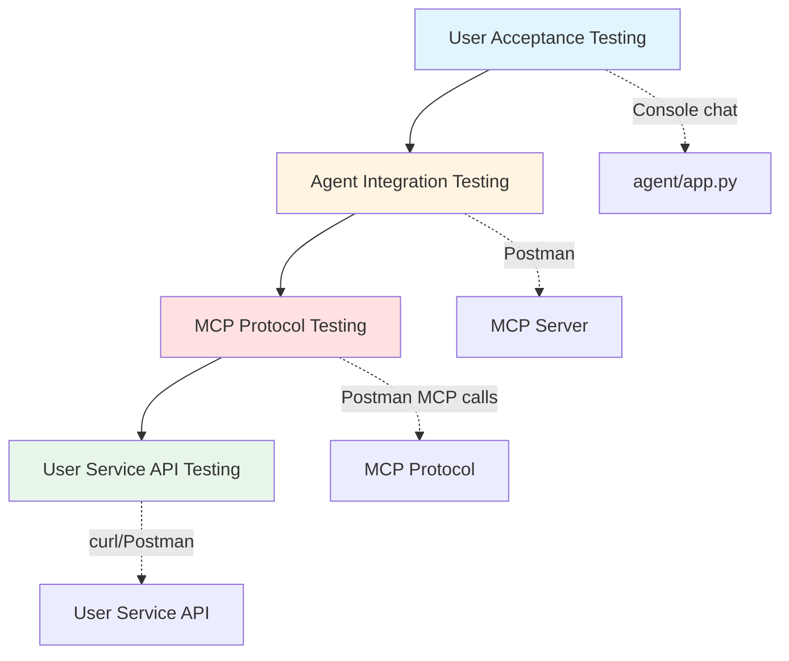

# Testing Guide

## Table of Contents
- [Test Strategy](#test-strategy)
- [Postman Collection](#postman-collection)
- [Manual Testing](#manual-testing)
- [Debugging Techniques](#debugging-techniques)
- [Test Scenarios](#test-scenarios)
- [Performance Testing](#performance-testing)

## Test Strategy

### Testing Layers



### Test Coverage

| Component | Test Method | Coverage | Status |
|-----------|------------|----------|--------|
| User Service API | Postman + curl | 100% | ✅ Complete |
| MCP Server Tools | Postman MCP | 100% (5 tools) | ✅ Complete |
| MCP Resources | Postman MCP | 100% (1 resource) | ✅ Complete |
| MCP Prompts | Postman MCP | 100% (2 prompts) | ✅ Complete |
| Agent Chat | Manual (console) | Functional | ✅ Complete |
| Error Handling | Manual + Postman | Partial | 🚧 Partial |

### Test Types

1. **Unit Tests:** Not implemented (manual verification via Postman)
2. **Integration Tests:** MCP protocol via Postman collection
3. **End-to-End Tests:** Agent console chat (manual scenarios)
4. **Performance Tests:** Load testing with concurrent requests (optional)

## Postman Collection

### Setup

1. **Import Collection**
   ```bash
   # Collection file location
   /Users/Dzianis_Haurylovich/Documents/git/git.epam.com/ai-dial-mcp-fundamentals/mcp.postman_collection.json
   ```

2. **Open Postman**
   - Click "Import" → Select `mcp.postman_collection.json`
   - Collection appears in left sidebar

### Collection Structure

```
MCP Collection
├── init                     # Initialize MCP session
├── init-notification        # Send initialization notification
├── tools/
│   ├── list                # List all available tools
│   └── call                # Execute a specific tool
├── resources/
│   ├── list                # List all resources
│   └── read                # Read resource content
└── prompts/
    ├── list                # List all prompts
    └── get                 # Get prompt details
```

### Session Management

MCP protocol requires session management via `mcp-session-id` header.

#### Step 1: Initialize Session

**Request:** `POST {{baseUrl}}/mcp`

**Response Headers:**
```
mcp-session-id: abc123def456...
```

**Action:** Copy `mcp-session-id` value for subsequent requests.

#### Step 2: Send Init Notification

**Request:** `POST {{baseUrl}}/mcp`

**Headers:**
```
mcp-session-id: abc123def456...
Content-Type: application/json
```

**Body:**
```json
{
    "jsonrpc": "2.0",
    "method": "notifications/initialized"
}
```

**Response:** `202 Accepted`

#### Step 3: Use Session ID

All subsequent requests must include `mcp-session-id` header.

### Testing Tools

#### List All Tools

**Request:** `POST {{baseUrl}}/mcp`

**Headers:**
```
mcp-session-id: <your-session-id>
Content-Type: application/json
```

**Body:**
```json
{
    "jsonrpc": "2.0",
    "id": 1,
    "method": "tools/list"
}
```

**Expected Response:**
```json
{
    "jsonrpc": "2.0",
    "id": 1,
    "result": {
        "tools": [
            {
                "name": "get_user_by_id",
                "description": "Retrieve a single user by ID...",
                "inputSchema": {
                    "type": "object",
                    "properties": {
                        "user_id": {"type": "integer"}
                    },
                    "required": ["user_id"]
                }
            },
            ...
        ]
    }
}
```

#### Call Tool: get_user_by_id

**Request:** `POST {{baseUrl}}/mcp`

**Headers:**
```
mcp-session-id: <your-session-id>
Content-Type: application/json
```

**Body:**
```json
{
    "jsonrpc": "2.0",
    "id": 2,
    "method": "tools/call",
    "params": {
        "name": "get_user_by_id",
        "arguments": {
            "user_id": 1
        }
    }
}
```

**Expected Response:**
```json
{
    "jsonrpc": "2.0",
    "id": 2,
    "result": {
        "content": [
            {
                "type": "text",
                "text": "```\nUser ID: 1\nName: Alice\nSurname: Johnson\nEmail: alice@example.com\n...\n```"
            }
        ]
    }
}
```

#### Call Tool: search_user

**Body:**
```json
{
    "jsonrpc": "2.0",
    "id": 3,
    "method": "tools/call",
    "params": {
        "name": "search_user",
        "arguments": {
            "name": "Alice",
            "gender": "female"
        }
    }
}
```

#### Call Tool: add_user

**Body:**
```json
{
    "jsonrpc": "2.0",
    "id": 4,
    "method": "tools/call",
    "params": {
        "name": "add_user",
        "arguments": {
            "name": "Test",
            "surname": "User",
            "email": "test@example.com",
            "about_me": "Test user for Postman",
            "company": "EPAM",
            "salary": 100000.0
        }
    }
}
```

#### Call Tool: update_user

**Body:**
```json
{
    "jsonrpc": "2.0",
    "id": 5,
    "method": "tools/call",
    "params": {
        "name": "update_user",
        "arguments": {
            "user_id": 1,
            "company": "EPAM Systems"
        }
    }
}
```

#### Call Tool: delete_user

**Body:**
```json
{
    "jsonrpc": "2.0",
    "id": 6,
    "method": "tools/call",
    "params": {
        "name": "delete_user",
        "arguments": {
            "user_id": 999
        }
    }
}
```

### Testing Resources

#### List Resources

**Body:**
```json
{
    "jsonrpc": "2.0",
    "id": 7,
    "method": "resources/list"
}
```

**Expected Response:**
```json
{
    "result": {
        "resources": [
            {
                "uri": "file:///static/flow.png",
                "name": "users-management-flow",
                "description": "API flow diagram",
                "mimeType": "image/png"
            }
        ]
    }
}
```

#### Read Resource

**Body:**
```json
{
    "jsonrpc": "2.0",
    "id": 8,
    "method": "resources/read",
    "params": {
        "uri": "file:///static/flow.png"
    }
}
```

### Testing Prompts

#### List Prompts

**Body:**
```json
{
    "jsonrpc": "2.0",
    "id": 9,
    "method": "prompts/list"
}
```

**Expected Response:**
```json
{
    "result": {
        "prompts": [
            {
                "name": "search-users-helper",
                "description": "Best practices for user search operations"
            },
            {
                "name": "profile-creation-guide",
                "description": "Guidelines for creating realistic user profiles"
            }
        ]
    }
}
```

#### Get Prompt

**Body:**
```json
{
    "jsonrpc": "2.0",
    "id": 10,
    "method": "prompts/get",
    "params": {
        "name": "search-users-helper"
    }
}
```

## Manual Testing

### User Service API (Direct)

#### Test 1: List All Users

```bash
curl http://localhost:8041/v1/users | jq '. | length'
# Expected: 1000
```

#### Test 2: Get User by ID

```bash
curl http://localhost:8041/v1/users/1 | jq '{id, name, surname, email}'
# Expected: User object with ID 1
```

#### Test 3: Search Users

```bash
curl "http://localhost:8041/v1/users/search?name=Alice&gender=female" | jq '. | length'
# Expected: Multiple users
```

#### Test 4: Create User

```bash
curl -X POST http://localhost:8041/v1/users \
  -H "Content-Type: application/json" \
  -d '{
    "name": "Test",
    "surname": "User",
    "email": "test@example.com",
    "about_me": "Test user"
  }' | jq '.id'
# Expected: New user ID (e.g., 1001)
```

#### Test 5: Update User

```bash
curl -X PUT http://localhost:8041/v1/users/1 \
  -H "Content-Type: application/json" \
  -d '{"company": "EPAM"}' | jq '.company'
# Expected: "EPAM"
```

#### Test 6: Delete User

```bash
curl -X DELETE http://localhost:8041/v1/users/1 -w "\n%{http_code}\n"
# Expected: 204
```

### Agent Console Testing

#### Test Scenario 1: Simple Query

```
You: search for users named Alice
🤖: Found 15 users matching "Alice"...
```

**Verification:**
- Agent executes `search_user` tool
- Results formatted as list
- No errors

#### Test Scenario 2: Multi-Step Workflow

```
You: Find user named Bob and update his company to EPAM
🤖: ⚙️ [Executes search_user]
    ⚙️ [Executes update_user]
    Updated Bob's company to EPAM.
```

**Verification:**
- Agent chains multiple tool calls
- Each tool completes successfully
- Final response confirms update

#### Test Scenario 3: Error Handling

```
You: Get user with ID 99999
🤖: ⚙️ [Executes get_user_by_id]
    Error: User with ID 99999 not found (HTTP 404)
```

**Verification:**
- Agent handles 404 error gracefully
- Error message clear and actionable
- No crash or unhandled exception

#### Test Scenario 4: Complex Query

```
You: Create a new user named Charlie Brown with email charlie@example.com, then search for all users named Charlie
🤖: ⚙️ [Executes add_user]
    ⚙️ [Executes search_user]
    Created user Charlie Brown (ID: 1001).
    Found 2 users named Charlie...
```

**Verification:**
- Agent handles create + search sequence
- Both operations complete
- Results reflect new user

## Debugging Techniques

### Enable Verbose Logging

#### MCP Server

**server.py:**
```python
import logging
logging.basicConfig(level=logging.DEBUG)

@mcp.tool()
async def get_user_by_id(user_id: int) -> str:
    print(f"[DEBUG] get_user_by_id: user_id={user_id}")
    result = await user_client.get_user(user_id)
    print(f"[DEBUG] Result length: {len(result)}")
    return result
```

#### Agent

**app.py:**
```python
import logging
logging.basicConfig(level=logging.DEBUG)

# Or print statements
print(f"[DEBUG] Messages: {[m.role for m in messages]}")
print(f"[DEBUG] Tool calls: {ai_message.tool_calls}")
```

### Inspect Network Traffic

#### MCP Protocol (HTTP Streams)

```bash
# Monitor MCP server logs
python mcp_server/server.py | tee mcp_server.log

# Watch agent requests
tail -f mcp_server.log | grep "TOOL"
```

#### User Service API

```bash
# Docker logs
docker-compose logs -f userservice

# Filter for errors
docker-compose logs userservice | grep ERROR
```

### Breakpoint Debugging

#### VS Code Launch Configuration

**Create `.vscode/launch.json`:**
```json
{
    "version": "0.2.0",
    "configurations": [
        {
            "name": "Python: Agent",
            "type": "python",
            "request": "launch",
            "program": "${workspaceFolder}/agent/app.py",
            "console": "integratedTerminal",
            "env": {
                "DIAL_API_KEY": "${env:DIAL_API_KEY}"
            }
        },
        {
            "name": "Python: MCP Server",
            "type": "python",
            "request": "launch",
            "program": "${workspaceFolder}/mcp_server/server.py",
            "console": "integratedTerminal"
        }
    ]
}
```

#### Set Breakpoints

1. Open [agent/dial_client.py](../agent/dial_client.py)
2. Click gutter next to line number (red dot appears)
3. Run "Python: Agent" debug configuration
4. Debugger pauses at breakpoint

### Common Debug Scenarios

#### 1. Tool Call Not Executing

**Symptoms:**
- LLM returns text instead of tool call
- Tool name misspelled in output

**Debug:**
```python
# In dial_client.py → _stream_response()
print(f"[DEBUG] Delta: {delta}")
print(f"[DEBUG] Tool deltas: {tool_deltas}")
```

**Check:**
- Tool schema sent to LLM matches MCP schema
- LLM model supports tool calling (gpt-4o does)

#### 2. Tool Result Not Formatted

**Symptoms:**
- LLM receives raw JSON instead of formatted string
- Agent confused by tool output

**Debug:**
```python
# In user_client.py → get_user()
print(f"[DEBUG] Raw response: {response.json()}")
print(f"[DEBUG] Formatted: {self.__user_to_string(user)}")
```

**Check:**
- `__user_to_string()` returns markdown code block
- No JSON serialization errors

#### 3. Session ID Lost

**Symptoms:**
- Postman "session not found" error
- MCP server rejects request

**Debug:**
1. Check `mcp-session-id` header in Postman
2. Verify session still active (no server restart)
3. Re-run `init` request to create new session

## Test Scenarios

### Scenario 1: User Lifecycle (CRUD)

**Goal:** Test all CRUD operations in sequence.

**Steps:**
1. **Create:** Add user "Test User" with email `test-crud@example.com`
2. **Read:** Get user by ID (from create response)
3. **Update:** Change company to "EPAM"
4. **Search:** Find user by email
5. **Delete:** Remove user

**Expected Results:**
- Each operation succeeds (HTTP 200/201/204)
- Read confirms create data
- Update reflects changes
- Search finds user
- Delete removes user (subsequent read returns 404)

**Postman Execution:**
```
1. tools/call → add_user (save ID from response)
2. tools/call → get_user_by_id (use saved ID)
3. tools/call → update_user (use saved ID)
4. tools/call → search_user (email filter)
5. tools/call → delete_user (use saved ID)
```

### Scenario 2: Search Edge Cases

**Goal:** Test search with various filter combinations.

**Test Cases:**
| Filter | Expected Result |
|--------|----------------|
| `name=Alice` | Multiple users |
| `name=Alice&gender=female` | Filtered subset |
| `email=gmail` | All Gmail users |
| `surname=Smith` | All Smiths |
| `name=ZZZZZZ` | Empty result (no match) |
| No filters | Error or all users (depends on API) |

**Postman Execution:**
```
tools/call → search_user (vary arguments parameter)
```

### Scenario 3: Error Handling

**Goal:** Verify graceful error handling.

**Test Cases:**
| Operation | Error Condition | Expected Response |
|-----------|----------------|-------------------|
| get_user_by_id | ID 99999 (not found) | 404 error message |
| add_user | Duplicate email | 409 conflict error |
| update_user | Invalid ID | 404 error message |
| delete_user | Already deleted | 404 error message |
| add_user | Missing required field | 400 validation error |

### Scenario 4: Agent Conversation Flow

**Goal:** Test multi-turn conversation with tool calls.

**Conversation:**
```
Turn 1:
You: How many users are in the system?
🤖: [No tool call] There are approximately 1000 mock users.

Turn 2:
You: Find users named Alice
🤖: ⚙️ [search_user] Found 15 users named Alice.

Turn 3:
You: Get details for the first one
🤖: ⚙️ [get_user_by_id] User ID: 1, Name: Alice, Email: ...

Turn 4:
You: Update her company to EPAM
🤖: ⚙️ [update_user] Updated Alice's company to EPAM.
```

**Verification:**
- Conversation history maintained across turns
- Tool results inform subsequent responses
- No context loss between turns

## Performance Testing

### Load Testing (Optional)

#### Concurrent Tool Calls

```python
# test_load.py
import asyncio
from agent.mcp_client import MCPClient

async def stress_test():
    async with MCPClient("http://localhost:8005/mcp") as client:
        tasks = [
            client.call_tool("get_user_by_id", {"user_id": i})
            for i in range(1, 101)  # 100 concurrent requests
        ]
        results = await asyncio.gather(*tasks, return_exceptions=True)
        errors = [r for r in results if isinstance(r, Exception)]
        print(f"Completed: {len(results) - len(errors)}, Errors: {len(errors)}")

asyncio.run(stress_test())
```

#### Metrics
- **Throughput:** Requests per second
- **Latency:** Average response time
- **Error Rate:** Failed requests percentage

### Memory Profiling

```python
# Profile agent memory usage
import tracemalloc
tracemalloc.start()

# Run agent
await main()

# Check memory
current, peak = tracemalloc.get_traced_memory()
print(f"Current: {current / 1024 / 1024:.2f} MB, Peak: {peak / 1024 / 1024:.2f} MB")
tracemalloc.stop()
```

## Test Checklist

### Pre-Deployment

- [ ] All User Service endpoints tested (GET/POST/PUT/DELETE)
- [ ] All MCP tools callable via Postman (5 tools)
- [ ] MCP resources accessible (1 resource)
- [ ] MCP prompts retrievable (2 prompts)
- [ ] Agent handles tool calls correctly (recursive loop)
- [ ] Error messages clear and actionable
- [ ] Session management works (mcp-session-id)
- [ ] Docker container starts and persists data
- [ ] Environment variables loaded correctly
- [ ] DIAL API connection successful (requires VPN)

### Edge Cases

- [ ] Empty search results handled
- [ ] 404 errors don't crash agent
- [ ] Duplicate email rejected gracefully
- [ ] Missing required fields validated
- [ ] Large result sets (100+ users) formatted correctly
- [ ] Long-running conversations maintain context
- [ ] MCP server restart doesn't break agent (reconnect)

---

**Next:** [Glossary](./glossary.md) for terminology reference  
**See also:** [API Reference](./api.md) for tool signatures
